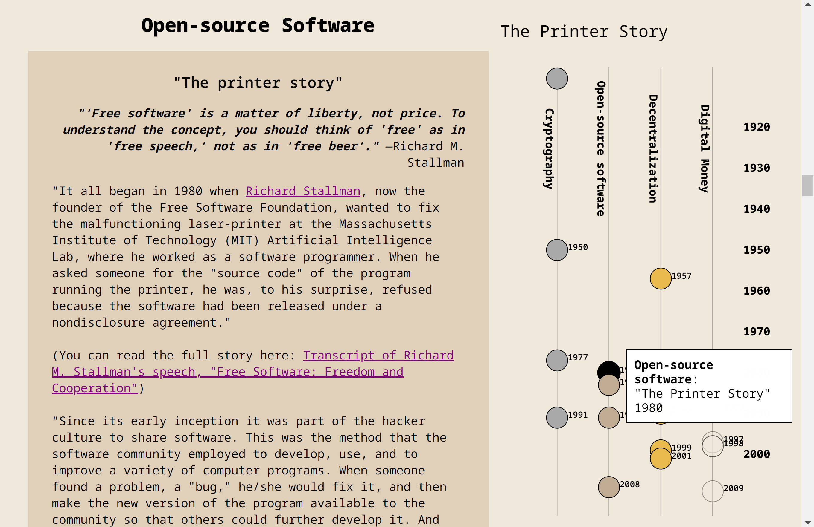

# **Blockchain: Key Principles** ([stable link](https://nchikurova.github.io/history-of-blockchain/key-principles/))

Capstone project for the MS Data Analysis & Visualization at The CUNY Graduate Center, 2022

## Abstract
  In October 2008 an unknown individual or a group of individuals under the name of Satoshi Nakomoto published a white paper [“Bitcoin: A Peer-to-Peer Electronic Cash System,”](https://nakamotoinstitute.org/bitcoin/) in which Bitcoin was described as “an electronic payment system based on cryptographic proof instead of trust, allowing any two willing parties to transact directly with each other without the need for a trusted third party”. 

  Bitcoin was launched in January 2009 and became the first successful cryptocurrency. Nowadays there are thousands of cryptocurrencies in the world. However, despite the cryptocurrencies’ popularity, not everyone understands what they are and how they can affect our future. There are two main questions I want to address in this project. First, is the history leading up to the creation of cryptocurrencies? Second, do cryptocurrencies have real value? I believe the real value of cryptocurrencies is in the technology they are built on – blockchain. 
  
  **“The Blockchain: Key Principles” is an interactive visual project that explains the importance of data privacy and security, decentralized computing, and open-source software in the modern digital world through the history of the underlying principles of blockchain technology.**
  
  Some of these key concepts have their roots in the time before the Information Age. By explaining the history of these principles, I want to present the fact that over the past centuries, humanity has been fighting for their privacy, security, and the ability to efficiently express themselves one way or another. Blockchain technology, which was introduced to the public in 2008 through a White Paper and launched in 2009 as Bitcoin cryptocurrency, provides the opportunity to achieve these goals. 
  
  **“The biggest threat to privacy that we face is that the power of computing is doubling every 18 months. The human population is not doubling every 18 months but the ability for computers to keep track of us is,” says Phil Zimmerman, reminding us of [Moore’s Law](https://www.umsl.edu/~siegelj/information_theory/projects/Bajramovic/www.umsl.edu/_abdcf/Cs4890/link1.html).**
  
  Zimmerman is the inventor of [Pretty Good Privacy](https://nakamotoinstitute.org/why-i-wrote-pgp/), which is software that provides data communication privacy through encryption (2002). While initially blockchain technology was created to improve the financial industry, the structure of blockchain, which allows users to store, validate and transmit data, provides transparency, decentralization, and trust and could also be profitable in other economic, legal, and political systems.

## How it all started

The idea of this capstone project came from my final project for the Alternative Data Culture course. This course aimed to explore alternative approaches to representing and understanding data, searching for hidden interpretation, and embracing subjective perspectives to generate new knowledge and create new meanings. We studied the aesthetics of text, art, digital images, and movies as objects of data visualization. One of the concepts that stood out for me was the interpretation of human thought through digital representation. In her book *SpecLab: Digital Aesthetics and Projects in Speculative Computing*, Johanna Drucker argues that code is material, and every digital piece is the presentation of human thought:

  > In every generation, some version of this question has been posted: If it were possible to understand the logic of human thought, would there be a perfect    representation of it in some unambiguous, diagrammatic symbol set? This question, informed by classical metaphysics and philosophy, persists not only in contemporary struggles within the very different domains of visual art, information design, and computer graphics, but also in early formulations of cognitive science, with proximity to symbolic logic, and in debates over artificial intelligence (Drucker).
  
As the object of my research, I chose a relatively new at that time movement in digital art – NFTs. As [my final project](https://drive.google.com/file/d/1al0kxoeDN9DfCD_8OcwiPfoXEetTXNq6/view), I explored NFTs (Non-Fungible Tokens) as a form of the interpretation of the human mind in the digital environment. By creating this project, I learned that **the main value of NFTs is their uniqueness. Each of these digital projects has a certificate of authenticity, which is provided by the technology they are built on – blockchain**. By learning more about blockchain and what can be created with it, I became interested in the initial purpose of creating it as well as its impact on our future.

My goal is to make this project understandable and easy to navigate for people with different backgrounds. 

## The future of the project

There are many different documentaries, videos, articles, and books that explain the history and timeline of the evolution of digital money. However, I haven’t seen any interactive visual projects presented on a webpage that users can explore at their own pace. For viewers who are new to this topic, it might be difficult to understand information as fast as it is presented in the documentaries and videos. Also, those people who absorb information more easily through visual medium might find it hard to read long articles and books. Therefore, I plan to continue this project in the future to provide a more interactive approach.
  
Despite technological advancement, the future of Bitcoin and cryptocurrencies’ is still uncertain. However, it is almost impossible to take control over Bitcoin mining, even for the government. One of the main reasons for it is the anonymity of Bitcoin’s inventor. This leads me to the first possible project extension.
  
 ### The Mystery of Satosho Nakomoto
 
 While this topic is more entertaining than educational, the question of Bitcoin’s inventor is one of the most discussed not only in the crypto community, but all over the world. It involves a lot of research and logical thinking and remains unsolved. Satoshi Nakomoto is the name that was used by Bitcoin’s creator. **Pseudonymity allows the project to stay neutral since there is no charismatic leader behind Bitcoin, and the project cannot be associated with any personality. Pseudonymity also protects the founder from any type of attack or government control.**
 
Satoshi Nakomoto was the first figure who worked on digital money and decided to stay unknown. All previous people who ever worked on digital money projects revealed their real names: David Chaum (“DigiCash”), Adam Back ([“HashCash”](https://nakamotoinstitute.org/static/docs/hashcash.pdf)), Wei Dai ([“B-Money”](https://nakamotoinstitute.org/b-money/)), Nick Szabo ([“BitGold”](https://nakamotoinstitute.org/bit-gold/)). A few years after announcing the project, Nakomoto disappeared leaving the code of Bitcoin as open-source software and giving the chance to other developers to work on and improve this code. There are many theories about who Satoshi Nakomoto is. Bitcoin’s creator might be an individual, a group of individuals or even an organization. 
  
The first possible candidate is **Harold Finney**. Hal Finney is a software developer who was advocating for cryptography and digital privacy, also known as the first person who helped Satoshi ([“The Wall Street Journal”](https://online.wsj.com/public/resources/documents/finneynakamotoemails.pdf)). The first-ever Bitcoin transaction was between Nakomoto and Hal Finney. In addition, Hal Finney was a neighbor of the person named Dorian Satoshi Nakomoto, who had no knowledge about the technical side of Bitcoin when asked. Hal Finney, however, denied being Satoshi Nakomoto ([Finney](https://bitcointalk.org/index.php?topic=155054.msg1643833#msg1643833)). Harold Finney died from complications of Amyotrophic lateral sclerosis in 2014. 
  
Another personality that some might think is behind the name of Satoshi Nakomoto is **Adam Back**. Adam Back is the founder of HashCash, one of the early attempts at creating digital money, which introduced the Proof-of-Work mechanism. Since Nakomoto communicated only digitally, his emails are one of the factors that are under close examination ([“Bitcoin P2P E-Cash Paper”](https://satoshi.nakamotoinstitute.org/emails/cryptography/threads/1/?view=satoshi)). Adam Back’s email replies to other bitcoiners show that his technical understanding of blockchain was more advanced than others. Adam also had the right set of skills, experience, writing patterns, and his absence in the time of Satoshi being around – all these facts are the evidence of the theory that Adam Back can potentially be Satoshi Nakomoto ([“The Strange Story of Satoshi Nakomoto’s Spelling Choices”](https://ungeared.com/the-strange-story-of-satoshi-nakamotos-spelling-choices-part-1/)).
  
A third possible candidate is **Nick Szabo**, the creator of Bit Gold, another early attempt at creating digital cryptocurrency, and the idea of smart contracts, which was introduced in his paper [“Smart Contracts: Building Blocks for Digital Markets”](https://fon.hum.uva.nl/rob/Courses/InformationInSpeech/CDROM/Literature/LOTwinterschool2006/szabo.best.vwh.net/smart_contracts_2.html) in 1996 (Szabo). He was also not as active as other cryptocurrencies activists in the time of Satoshi Nakomoto’s presence, despite the fact that Bit Gold is one of the prototypes of Bitcoin. Interestingly, there is no reference to Bit Gold in Bitcoin white paper, even though there are clear similarities in between their systems used to process transactions and to secure the decentralized network.
  
Besides names mentioned above, there are several more personalities that are connected to Satoshi Nakomoto’s name. However, the candidates above are the most well-known people who are related to Nakomoto and Bitcoin and all of them are members of the cypherpunk community, which leads me to the next possible extension of my project. 

### The Cypherpunk Movement

The cypherpunk movement is the community that is advocating for the privacy of individuals through cryptography. This movement was founded in the early 1990s by a few scientists who started to meet regularly to discuss their work and related ideas. They also created the Cypherpunk mailing list in which many proposals and developments were discussed including the ones that later lead to Bitcoin. Eric Hughes, one of the first cypherpunks, wrote [“A Cypherpunk Manifesto”](https://nakamotoinstitute.org/cypherpunk-manifesto/), where he describes the key principle of cypherpunk movement - the importance of privacy. **“Privacy is necessary for an open society in the electronic age. Privacy is not secrecy. A private matter is something one doesn't want the whole world to know, but a secret matter is something one doesn't want anybody to know. Privacy is the power to selectively reveal oneself to the world” (Hughes).**
  
The ideas explained in the Cypherpunk Manifesto became the fundamental concepts for early attempts of developing digital currencies. The concepts presented in the Cypherpunk Manifesto are as relevant today as they were in 1993:
  
> We must defend our own privacy if we expect to have any. We must come together and create systems which allow anonymous transactions to take place. People have been defending their own privacy for centuries with whispers, darkness, envelopes, closed doors, secret handshakes, and couriers. The technologies of the past did not allow for strong privacy, but electronic technologies do (Hughes). 

### The History of Digital Money (coming next)

Is it a coincidence that Bitcoin was introduced the same year that the U.S. financial crisis happened? In that time many people started to reconsider the role of government and banks in the financial system, and, possibly, look for some type of alternatives. 

To speak about digital money, we need to answer a few questions first: What is money? Where does money come from and what is its purpose? 

Nineteenth century economist Carl Menger first described how money evolves naturally and inevitably from a sufficient volume of commodity barter (Menger 239-55). From ancient times till nowadays, money is just an exchange medium for goods. In ancient times many different objects were used as money: rocks (Rai stones), beads, seashells, cattle, and even salt. The English adjective *pecuniary* and noun *salary* were derived from the Latin words *pecus* (cattle) and *sal* (salt) (Fekete). Historical accounts show that the most salable seashells were usually the ones that were scarcer and harder to find, because these would hold value more than the ones that can be found easily (Szabo). According to Carl Menger, a good’s salability across the time refers to its ability to hold value into the future, allowing the holder to store wealth in it (Menger 239-55).

Later, seashells, rocks and other objects were replaced by coins made from the rare metals: gold, silver, and copper. Due to metals’ durability, they held the value of money across time better than any other goods (Ammous ch.1) To store money and wealth people needed a safe place to keep their coins – that is how the first predecessors of banks appeared. Since it was too heavy to carry metallic coins around, people would bring them to one place where the banker would store them in a safe and give out a paper that proved how many coins each holder had in the bank and how many were taken out.

Later, the bankers realized that almost no one was taking out all the coins they own at once, and, therefore, the bankers could use this money to lend it to someone else for compound interest or use it for their own purposes. 

This realization was the first step for creating the banking system we have now – the fractional reserve system: banks are permitted to keep only a fraction of deposited money in the bank. The next step to exploit this system was understanding that nobody knows how much physical money is in a bank and the amount of money being lent to a third-party on paper could exceed the amount of physical money in the bank. The ratio of banks’ total loans to its total deposits is called loan-to-deposit-ratio. For example, if the loan-to-deposit ratio is 0.9, it means that for every 10% of existing money in the bank (deposit), the bank can lend 90% of the money to someone else (loans), where 90% of loans are new money created by banks. According to the board of Governors of the Federal Reserve System, as announced on March 15, 2020, the Board reduced reserve requirement ratios to zero percent effective March 26, 2020. This action eliminated reserve requirements for all depository institutions ([Federal Reserve Board](https://www.federalreserve.gov/monetarypolicy/reservereq.htm) - Accessed 16 Nov. 2021).

The only problem the banker can face is if all the customers decide to take out their money at the same time. This problem was solved by centralizing the banking system; if one of the banks does not have enough money to give back to depositors, the Central Bank can always provide this money. This system has failed a few times in the history of the United States, including the financial crisis in 2008.

In the past, all created money needed to be registered on paper – declarations, statements, checks, nowadays most money is digital and even easier to create. The new money created by the Federal Reserve has formed the national debt. According to the U.S. Department of the Treasury, the national U.S. debt by November 2021 is $28.8 billion ([United Stated Department of the Treasury](https://home.treasury.gov/policy-issues/financial-markets-financial-institutions-and-fiscal-service/debt-limit) - Accessed 16 Nov. 2021). 

The ideology behind Bitcoin comes from the Austrian school of economy. They believed that an infinite supply of money is one of the factors that lead to inflation. “Followers of the Austrian school strongly believe in the need for a market-selected money-form with a finite supply, leading many of them to advocate for a return to the gold standard. For this reason, the upper limit is purposeful in the design of Bitcoin and derives from the Austrian school of economics’ suspicions of fiat currency” (Lally et. al. 2). There will never be more than 21 million of Bitcoin. The upper limit of bitcoins is meant to provide a “known supply and a known inflation schedule, unlike fiat money” (qtd. Lally et. al. 5).

**The history of the development of digital money has a significant impact on the existence of the blockchain.** Despite the importance of the blockchain key principles I describe in my project, blockchain technology would not exist if it were not for creating an alternative to the traditional form of money. The idea of creating digital money, or cryptocurrencies, enabled scientists to generate many ways of improving some features of the current financial system, especially in the digital world we live in now. Each attempt of creating digital money was bringing to the world more advanced technological mechanisms and concepts, that, one way or another, would better protect, store, record, or transmit data throughout the internet. While the focus of this project is not on attempts to substitute the current financial system and replace traditional money with cryptocurrencies, I think it is important to mention digital money when speaking of the blockchain. 

Initially, the blockchain technology was developed to improve some aspects of the current financial system or/and introduce a new cash system. However, the technology itself already has had an impact on the other industries, like healthcare or supply management chain. Atzori suggests that it also has a potential to restructure society and government services. “The blockchain technology potentially allows individuals and communities to redesign their interactions in politics, business and society at large, with an unprecedented process of disintermediation on large scale, based on automated and trustless transactions” (Atzori 46). Some areas of our lives historically relied on third parties to establish a certain amount of trust. 

> Reorganizing societies is of prime importance in poor countries. Wealth can be protected more effectively using the blockchain. These existential threats can be controlled by integrating land titles into the blockchain. Especially in the third world, landowners have problems to prove the ownership if for example the local government aims to expropriate the population (Nofer et. al. 183 -187).

The identity verification through blockchain can also be used in the third world and by immigrants when the proof of identity is lost. The decentralized trust or trust-by-computation, ensured by proof-of-work protocol, makes presence of human intervention or controlling authority unnecessary. Atzori identifies this protocol as “a shift from trusting people to trusting math” and states that its “applicability goes far beyond the creation of decentralized digital currencies” (qtd. in Atzori 45).

## Summary

Blockchain is a distributed ledger that holds, records, and transmits data. Blockchain is the underlying technology which Bitcoin was built on. Even though blockchain is still relatively new technology and needs to be researched and studied to utilize its best qualities and increase its efficiency, it has already impacted many industries, such as finance, healthcare, supply chain, manufacturing, and others.
  
The history of underlying principles of blockchain described in this project should help us to identify the most important features of blockchain and to understand the potential of this technology, and possible impact on the future. 
  
Encrypted algorithms ensure the security and automated trust of the ledger, as well as the stability and immutability of the data records. Decentralization of the network provides protection, transparency, and verification of the data. Open-source nature of this software allows everyone to inspect, share and improve the code while maintaining the transparency of the data and changes on the platform. 
  
In addition, one of the most important features of blockchain is that this technology allows users, businesses, and industries to build applications on top of the ledger which provides countless possibilities of beneficial utilization of blockchain in the future.

Full text of White Paper, list of references, and the process of creating this project you can find [here](https://drive.google.com/file/d/1zNCir-TjSX0uhM_5qYLOunSjXnHg-8ml/view?usp=sharing).
